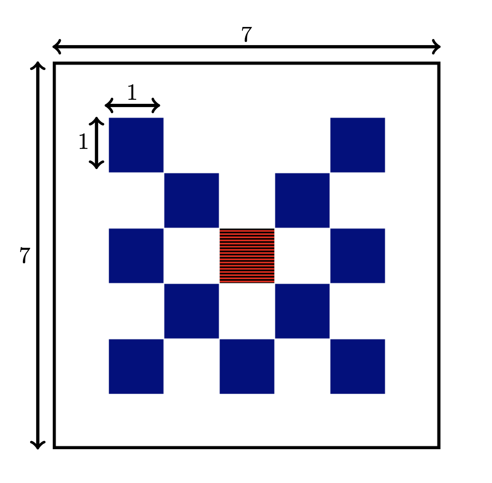

# CharmNet
CharmNet Benchmarking Suite using the [UM-Bridge UQ suite](https://um-bridge-benchmarks.readthedocs.io/en/docs/) and the [KiT-RT PDE simulator](https://kit-rt.readthedocs.io/en/develop/index.html). 

CharmNet contains a series of testcases outlined below. 

## Installation

Preliminaries: 

1. Install [singularity](https://docs.sylabs.io/guides/3.0/user-guide/installation.html) on your system. 

2. Install the python requirements in a local virtual environment

    ```
    python3 -m venv ./venv
    source venv/bin/activate
    pip install -r requirements.txt
    ```

2. Install [KiT-RT](https://github.com/CSMMLab/KiT-RT) on your system.
    Use the installer
    ```
    sh install_KiT-RT.sh
    ```

    Use the updater to stay up to date with the PDE solver
    ```
    sh update_KiT-RT.sh
    ```


Install the python requirements in a local virtual environment

```
python3 -m venv ./venv
source venv/bin/activate
pip install -r requirements.txt
```

Install [singularity](https://docs.sylabs.io/guides/3.0/user-guide/installation.html) on your system. 

Build the kit_rt singularity container on your system (root access required).
```
cd singularity
sh build_container.sh
```


 If you use a cluster without root access, build the container locally and upload it to the directory `./singularity/` 

## Homogeneous lattice test case

### Setup

The lattice test case models an isotroptic radiative source in the center of the computational domain sourounded by blue and white squares.

By default,  the absorption and scattering values as well as the source magnitude are given by the table below

|          | absorption | scattering | source |
|----------|----------|----------|----------|
| blue     | 10       | 0        | 0        |
| red      | 0        | 1        | 1        |
| white    | 0        | 1        | 0        |


The absorption and scattering coefficient are the design parameters for this UQ study. Additional design parameters are the the number of grid cells in each coordinate direction for each square of the lattice geometry and the quadrature order of the velocity space discretization. 

Design parameters are in this order: 

- number of grid points per square side
- quadrature order
- aborption in blue squares
- scattering in white squares

For illustration: 10 grid points means that each of the inner squares has (2*10)^2 cells, and each of the 24 outer squares has 10^2 cells.

Quantities of interest are in this order: 

- CUR_OUTFLOW
- TOTAL_OUTFLOW
- MAX_OUTFLOW
- CUR_PARTICLE_ABSORPTION
- TOTAL_PARTICLE_ABSORPTION
- MAX_PARTICLE_ABSORPTION
- WALL_TIME

Thus the KiT-RT model is a map $F:\mathbb{R}^4\mapsto\mathbb{R}^7$. 

The KiT-RT solver config is given in `benchmarks/lattice_homogeneous/lattice.cfg` 

There one can change the mesh resolution, quadrature order for the velocity space, CFL numbers, discretization order, etc. 

### Execution

Run the UM-Bridge model server

```
python server_lattice_homogeneous.py
```

Run the UQ script (with default settings)

```
python main_lattice_homogeneous.py
```

If you want to change the values of the design parameters, consider the file `main_lattice_homogeneous.py` (beta)